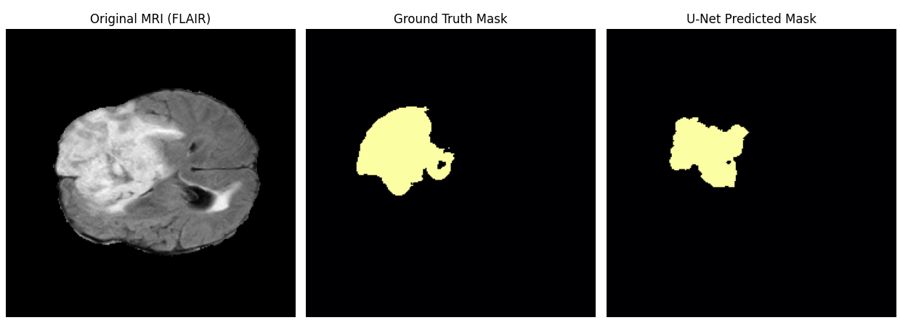
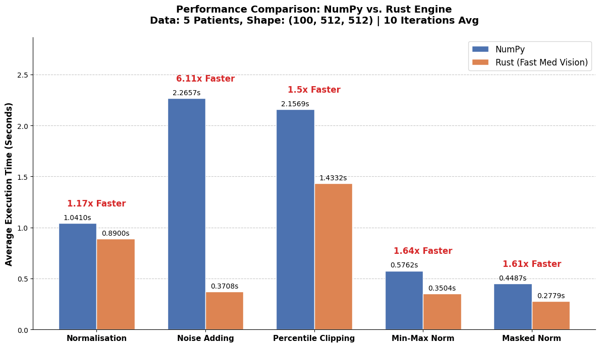
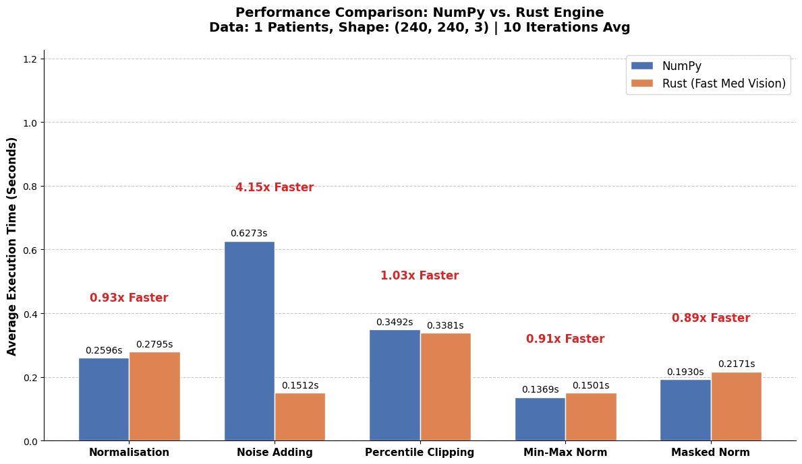

# Fast_Med_Vision (Open-Source Project)

**Fast Med Vision** is a high-performance, hybrid end-to-end medical image processing pipeline. It combines the rapid prototyping capabilities of Python/PyTorch with the raw execution speed and memory efficiency of a custom Rust engine.

Designed specifically for processing 3D MRI scans (BraTS 2020 dataset), this project tackles the common bottlenecks of medical computer vision: heavy memory allocation and single-threaded preprocessing constraints.

## Key Features
- **Rust-Accelerated Preprocessing Engine**: Custom preprocessing functions (Normalisation, Min-Max Scaling, Percentile Clipping, Gaussian Noise) written in Rust and exposed to Python via `PyO3` and `Maturin`.
- **Zero-Cost Abstractions & Operation Fusion**: Significantly reduces memory overhead by fusing operations and avoiding intermediate array allocations, outperforming standard NumPy implementations in memory-heavy tasks.
- **Multi-Core Concurrency**: Leverages Rust's rayon crate to parallelise array operations across all available CPU cores, breaking free from Python's Global Interpreter Lock (GIL).
- **End-to-End PyTorch Pipeline**: Seamlessly integrates the Rust preprocessing engine into a standard PyTorch `DataLoader`, driving the training of a custom U-Net architecture for brain tumour segmentation.

## Segmentation Results
The PyTorch U-Net model, trained on the data preprocessed by our custom Rust engine, successfully segments the brain tumour regions with high accuracy.



## Performance Benchmarks & Architectural Insights

To rigorously validate the Rust engine, Two phases of benchmarking were conducted: one testing raw computational throughput on massive dense volumes, and another testing realistic slice-by-slice integration.


### Phase 1: The Raw Power (Simulated Dense 3D Volumes)
I first tested the engine against highly optimised NumPy (C-backend) implementations using large, dense simulated 3D volumes (Shape: `100x512x512`, 5 Patients).



In this environment, the Rust engine's zero-cost abstractions and `rayon`-powered multi-core concurrency absolutely dominate, achieving significant speedups across **all** preprocessing tasks, peaking at a **6.11x** speedup for memory-intensive operations like Gaussian Noise addition.

### Phase 2: The Integration Reality & FFI Tax (Real BraTS Slices)
I then tested the engine in a realistic PyTorch DataLoader scenario, processing real BraTS MRI data slice-by-slice (Shape: `240x240x3`, 1 Patient volume (155 slices)).



This comparison reveals a fascinating architectural insight:
1. **Superior Memory Efficiency Remains:** For computationally heavy tasks requiring extensive memory allocation (Noise Adding), Rust's in-place mutations continue to crush Python/NumPy, maintaining a massive **4.15x speedup**.
2. **The FFI Boundary Tax:** For computationally simpler operations (like Min-Max Scaling or Masked Normalisation), the performance drops to ~0.9x. This is not due to Rust's computation speed, but rather the **Foreign Function Interface (FFI) overhead**. Passing 155 individual 2D slices sequentially through a Python `for` loop incurs the cost of crossing the Python-Rust boundary 155 times per patient.

### Future Work: Loop Sinking & 3D Volume Processing
This dual-benchmark analysis provides a clear roadmap for future optimisation: **Loop Sinking**. By restructuring the Rust `lib.rs` interface to accept entire `(155, 240, 240, 4)` 3D tensors directly rather than 2D slices, we can reduce the FFI crossings from 155 to just 1. Combined with `rayon`'s parallel iteration over the higher-dimensional arrays, this will maximize CPU cache hits and ensure the Rust engine vastly outperforms NumPy across *all* realistic dataloader scenarios.


## Project Structure
```
FAST_MED_VISION/
├── benchmarks/
│   ├── Brats/
│   │   └── benchmark_brat.py         # Real MRI data extreme stress testing
│   └── Simulation/                   # Simulated benchmarking
│       ├── benchmark_clip.py         
│       ├── benchmark_mask.py
│       ├── benchmark_minmax.py
│       ├── benchmark_noise.py
│       ├── benchmark_normalisation.py
│       └── benchmarks_sim.py         # Comprehensive simulated benchmark suite
├── data/                             # BraTS 2020 dataset directory (ignored in git)
├── EDA/
│   ├── download_data.py              # Data acquisition scripts
│   └── explore_h5.py                 # HDF5 file inspection and visualisation
├── src/
│   └── lib.rs                        # Core Rust preprocessing engine
├── tests/                            # Unit tests
├── .env                              # Environment variables
├── .gitignore
├── best_model.pth                    # Trained U-Net model weights (ignored in git)
├── brats_dataset.py                  # PyTorch Dataset & Transforms implementation
├── Cargo.lock
├── Cargo.toml                        # Rust dependencies and project metadata
├── plots.ipynb                       # Visualisation notebooks
├── predict.py                        # Inference script with Matplotlib visualisation
├── README.md
├── train.py                          # PyTorch training loop
└── unet.py                           # U-Net model architecture
```

## Getting Started
**Prerequisites**
- Python 3.9+
- Rust (Cargo)
- CUDA-enabled GPU (Recommended for training)

**Installation & Setup**
1. **Clone the repository:**
```Bash
git clone https://github.com/ho0212/Fast_Med_Vision.git
cd Fast_Med_Vision
```
2. **Install Python dependencies:**
```Bash
pip install torch torchvision numpy h5py matplotlib
```
3. **Compile the Rust Engine:** 
You must use `maturin` to build the Rust bindings. Make sure to compile in release mode for maximum performance!
```Bash
pip install maturin
maturin develop --release
```

**Usage**
- **Train the Model:**
```Bash
python train.py
```
- **Run Inference & Visualisation:**
```Bash
python predict.py
```
- **Run Benchmarks:**
```Bash
python benchmarks/Brats/benchmark_brat.py
```

## References
- **U-Net Architecture:** Ronneberger, O., Fischer, P., & Brox, T. (2015). U-Net: Convolutional Networks for Biomedical Image Segmentation. In *Medical Image Computing and Computer-Assisted Intervention – MICCAI 2015* (pp. 234–241). Springer International Publishing. [https://arxiv.org/abs/1505.04597](https://arxiv.org/abs/1505.04597)

- **BraTS Dataset:** Menze, B. H., Jakab, A., Bauer, S., Kalpathy-Cramer, J., Farahani, K., Kirby, J., ... & Van Leemput, K. (2014). The Multimodal Brain Tumor Image Segmentation Benchmark (BRATS). *IEEE Transactions on Medical Imaging*, 34(10), 1993-2024.